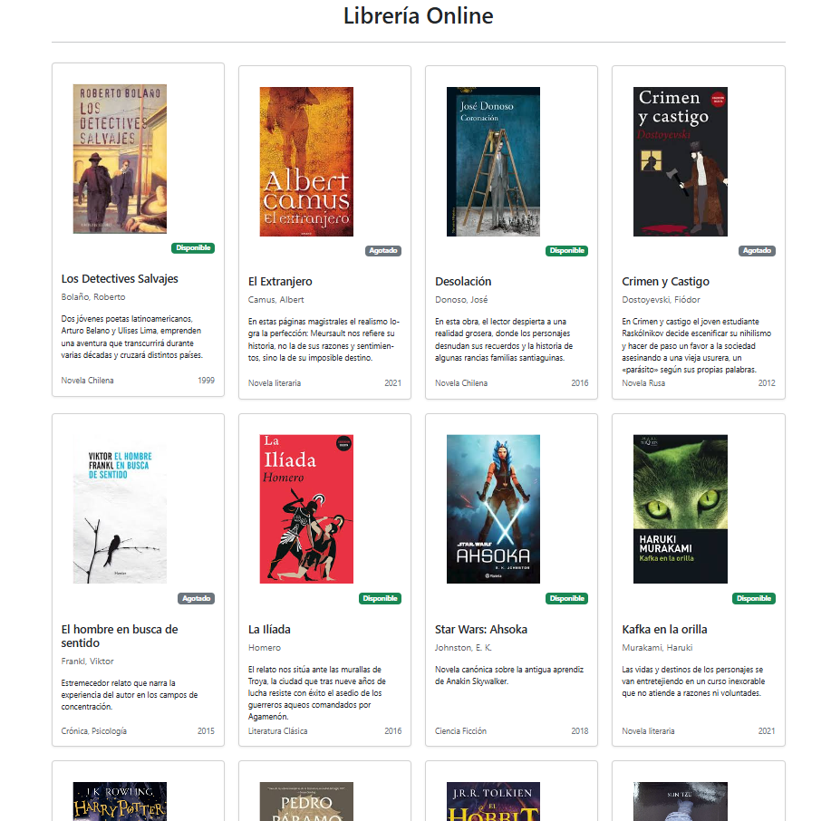
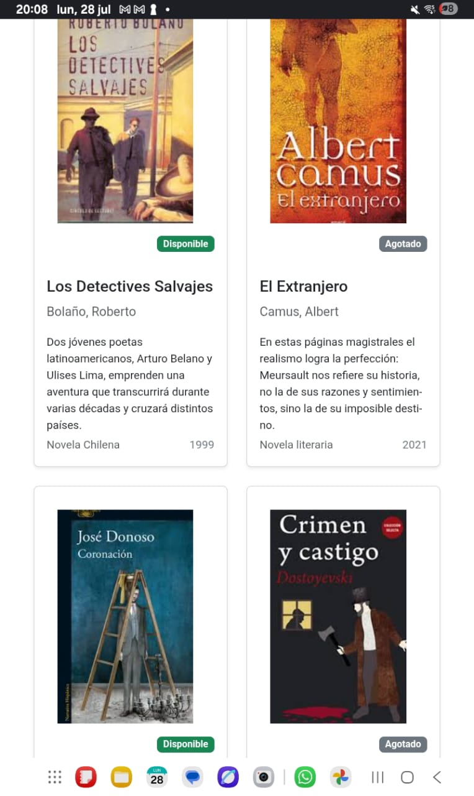
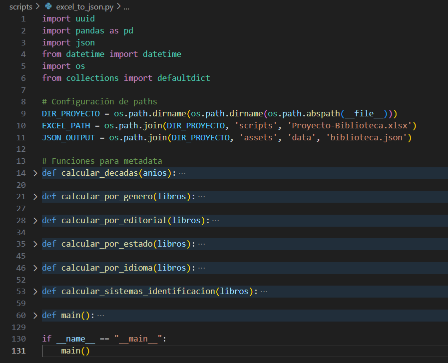
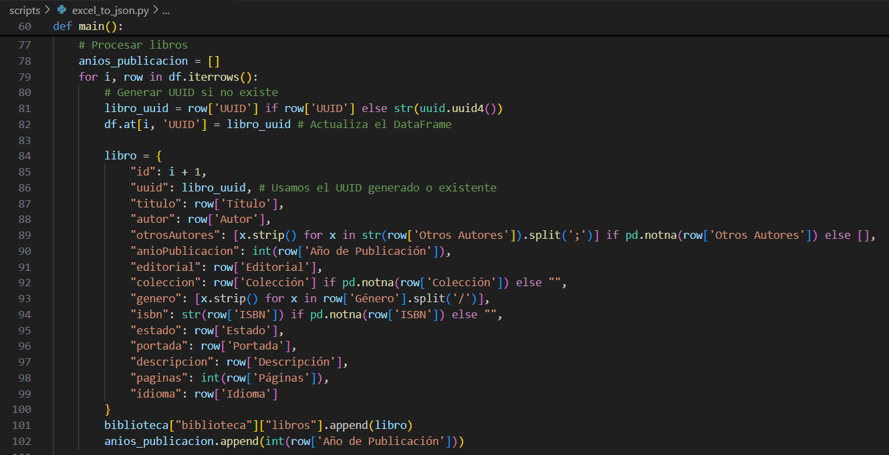

# 📚 Script-Libreria-Online 

**Solución digital completa** para gestionar catálogos de libros. Convierte datos desde Excel a JSON y muestra el contenido en una interfaz web moderna y responsive.

<div align="center">
  
  ## 🖥️ Vista Desktop
  
  <br>
  <hr>
  
  ## 📱 Vistas Móvil | Tablet
  
  <div style="display: flex; justify-content: center; flex-wrap: wrap; gap: 20px;">
    
    
    <br><hr><br>
    
    
    
  </div>

</div>

---

## 🛠️ Stack Tecnológico

| Área       | Tecnologías                 |
|------------|-----------------------------|
| **Backend**  | Python 3, Pandas            |
| **Frontend** | HTML5, CSS3, JavaScript     |
| **Herramientas** | Git, GitHub Pages       |
| **Formato**  | Excel, JSON                 |

---

## ⚙️ Funcionamiento  

### 1. Estructura del proyecto  
```bash
.
├── README.md
├── assets/
│   ├── data/
│   │   └── biblioteca.json      # Output JSON
│   └── img/
│       └── portadas/           # Book covers
├── css/
│   └── styles.css              # Main styles
├── index.html                  # Entry point
├── js/
│   └── script.js               # Render logic
├── requirements.txt            # Python dependencies
├── screenshots/                # UI previews
└── scripts/
    ├── Proyecto-Biblioteca.xlsx # Source data
    └── excel_to_json.py        # Conversion script
```

### 2. Corazón del proyecto: `script.py`  
El script convierte los datos de Excel a JSON con **Pandas**, limpiando y formateando la información.

<div align="center">
  
  ## 🐍 Script Python - Proceso de Conversión
  
  <div style="display: flex; justify-content: center; gap: 30px; flex-wrap: wrap;">
    <div>
      
      <p><em>Imports y funciones</em></p>
    </div>
    <div>
      
      <p><em>Manejo principal</em></p>
    </div>
  </div>

</div>

### 3. Instalación del proyecto:

1. Clonar repositorio
```bash
git clone git@github.com:jmcstoltze/script-libreria.git
cd script-libreria
```
2. Configurar entorno virtual (recomendado)
```bash
python -m venv venv
source venv/bin/activate  # Linux/Mac
venv\Scripts\activate    # Windows
```
3. Instalar dependencias
```bash
pip install -r requirements.txt
```
4. Ejecutar el script de conversión
```bash
python3 scripts/excel_to_json.py
```
5. Ejecutar el index.html (Recomendado con Live Server)
